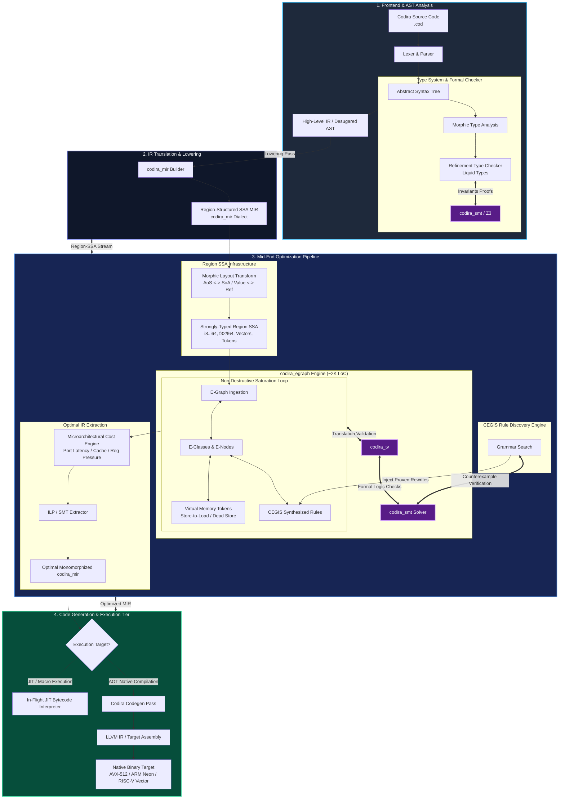

<!--
Copyright (c) 2026 Omnira CJSC
Author: Tunjay Akbarli
Date: August 6, 2026

Functionality: Codira Programming Language
-->

# Codira Programming Language 
### Stable Version: 26.9
### Build: September 15, 2026.

_Codira_ is an Ahead of Time (AOT) programming language for high performance systems.

## Features

- **Ahead of time compilation** - Codira is compiled ahead of time (AOT), as
  opposed to being interpreted or compiled just in time (JIT). By detecting
  errors in the code during AOT compilation, an entire class of runtime errors
  is eliminated. This allows developers to stay within the comfort of their IDE
  instead of having to switch between the IDE and target application to debug
  runtime errors.

- **Statically typed** - Codira resolves types at compilation time instead of at
  runtime, resulting in immediate feedback when writing code and opening the
  door for powerful refactoring tools.

- **First class hot-reloading** - Every aspect of Codira is designed with hot
  reloading in mind. Hot reloading is the process of changing code and resources
  of a live application, removing the need to start, stop and recompile an
  application whenever a function or value is changed.

- **Performance** - AOT compilation combined with static typing ensure that Codira
  is compiled to machine code that can be natively executed on any target
  platform. LLVM is used for compilation and optimization, guaranteeing the best
  possible performance. Hot reloading does introduce a slight runtime overhead,
  but it can be disabled for production builds to ensure the best possible
  runtime performance.

- **Cross compilation** - The Codira compiler is able to compile to all supported
  target platforms from any supported compiler platform.

- **Powerful IDE integration** - The Codira language and compiler framework are
  designed to support source code queries, allowing for powerful IDE
  integrations such as code completion and refactoring tools.
  

## Example

<!-- inline HTML is intentionally used to add the id. This allows retrieval of the HTML -->
<pre language="codira">
<code id="code-sample">func fibonacci(n: i32) -> i32 {
    if n <= 1 {
        n
    } else {
        fibonacci(n - 1) + fibonacci(n - 2)
    }
}

// Comments: functions marked as `public` can be called outside the module
public func main() {
    // Native support for bool, f32, f64, i8, u8, u128, i128, usize, isize, etc
    let is_true = true;
    let var = 0.5;

    // Type annotations are not required when a variable's type can be deduced
    let n = 3;

    let result = fibonacci(n);

    // Adding a suffix to a literal restricts its type
    let lit = 15u128;

    let foo = record();
    let bar = tuple();
    let baz = on_heap();
}

// Both record structs and tuple structs are supported
struct Record {
    n: i32,
}

// Struct definitions include whether they are allocated by a garbage collector
// (`gc`) and passed by reference, or passed by `value`. By default, a struct
// is garbage collected.
struct(value) Tuple(f32, f32);

struct(gc) GC(i32);

// The order of function definitions doesn't matter
func record() -> Record {
    // Codira allows implicit returns
    Record { n: 7 }
}

func tuple() -> Tuple {
    // Codira allows explicit returns
    return Tuple(3.14, -6.28);
}

func on_heap() -> GC {
    GC(0)
}</code>
</pre>


## Building from Source

Make sure you have the following dependencies installed on your machine:

* Rust
* LLVM 22.1 (a full dev distribution with `llvm-config` and the LLD static
  libraries; point `LLVM_SYS_221_PREFIX` at its install root -- see
  `book/src/dev/02-building-llvm.md`)
* Z3 (`libz3` -- used by `codira_smt` for refinement-type checking and
  translation validation)

Clone the source code, including all submodules:

```bash
git clone https://github.com/theomnira/codira.git
git submodule update --init --recursive
```

Use `cargo` to build a release version

```bash
cargo build --release
```

## Language server

Codira contains support for the lsp protocol, start the executable using:

```bash
codira language-server
```

Alternatively, you can install editor-specific extensions.
